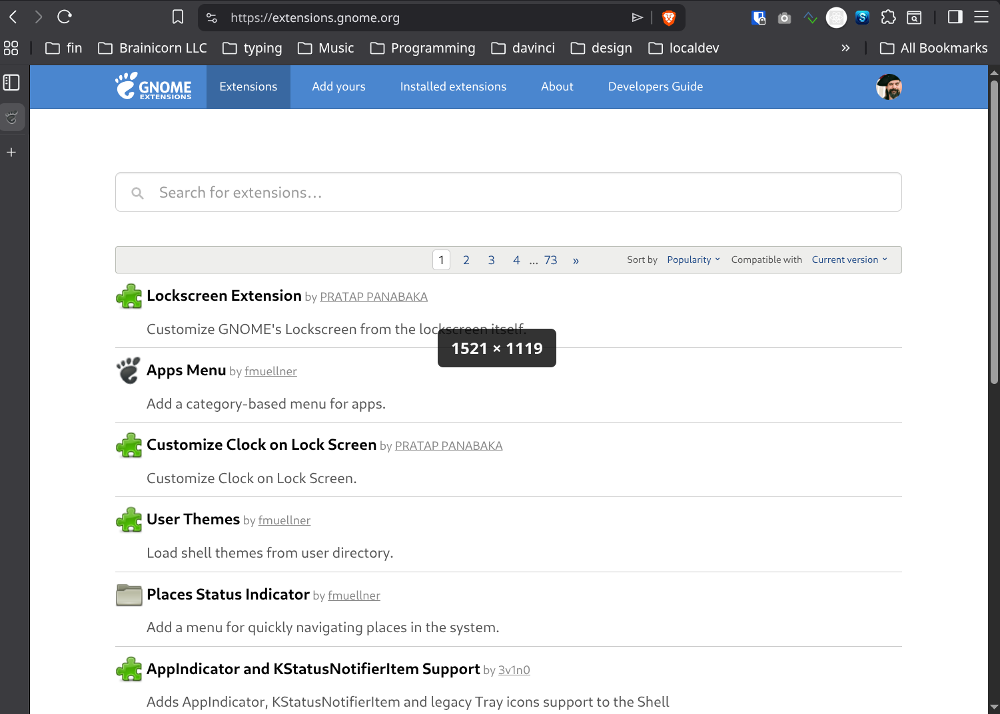

# Window Dimensions - GNOME Shell Extension

A simple GNOME Shell extension that displays window dimensions while you resize them.



## Features

- Shows real-time dimensions (width × height) when resizing any window
- Works seamlessly on both Wayland and X11
- Displays dimensions in the center of the window being resized
- Clean, minimalist design with dark semi-transparent background

## Installation

### Manual Installation

1. Copy the extension to your local extensions directory:
   ```bash
   mkdir -p ~/.local/share/gnome-shell/extensions/windim@brainicorn.com
   cp -r * ~/.local/share/gnome-shell/extensions/windim@brainicorn.com/
   ```

2. Restart GNOME Shell:
   - On X11: Press `Alt+F2`, type `r`, and press Enter
   - On Wayland: Log out and log back in

3. Enable the extension:
   ```bash
   gnome-extensions enable windim@brainicorn.com
   ```

   Or use GNOME Extensions app to enable it.

## Usage

Once enabled, simply resize any window and you'll see the dimensions displayed in the center of your screen. The dimensions disappear when you finish resizing.

## Compatibility

- GNOME Shell 45+
- Works on both X11 and Wayland (optimized for Wayland)

## Uninstallation

```bash
gnome-extensions disable windim@brainicorn.com
rm -rf ~/.local/share/gnome-shell/extensions/windim@brainicorn.com
```

## License

MIT License
